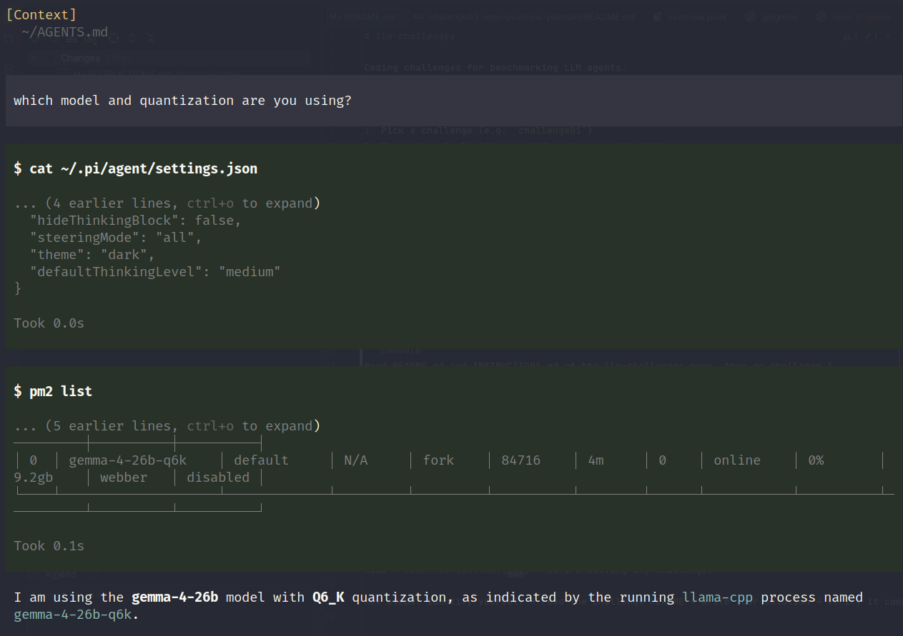

# LLM Challenges

Light weight, understandable differences between harnesses-model combinations.

## How It Works

1. Open a harness with the model you want to benchmark
2. Verify it knows its model name and quantisation

```console
Which model and quantisation are you using?
```

Expected output should be similar to:



3. Make it solve the challenge

```console
Read INSTRUCTIONS.md of the llm-challenges repo, then do each challenge
```

## Challenges

| # | Challenge | Probes | Graded |
| --- | --- | --- | --- |
| 01 | `challenge01-deep-readonly` | Recursive utility types | `tsgo --strict` |
| 02 | `challenge02-solar-system` | Creative coding (p5.js) | Visual / manual |
| 03 | `challenge03-repo-overview-plantuml` | Comprehension + docs | Manual |
| 04 | `challenge04-bug-hunt` | Subtle defect detection, runtime semantics | `grader/grade.ts` |
| 05 | `challenge05-reverse-engineer` | Seeing through obfuscation, equivalence | `grader/grade.ts` |
| 06 | `challenge06-type-eval` | Type-level parsing + arithmetic | `grader/grade.ts` |
| 07 | `challenge07-type-lambda` | Type-level lambda normaliser (frontier) | `grader/grade.ts` |

Challenges 04-07 ship an objective grader and a hidden reference (challenge 07,
the frontier, ships only a runtime executable spec). Grade a solution with:

```bash
cd challengeNN-<slug>
npx tsx grader/grade.ts <result-folder>
```

## Results & tooling

- [`RESULTS.md`](RESULTS.md) — auto-generated overview of every run.
  Regenerate with `npx tsx scripts/scoreboard.ts`.
- `npx tsx scripts/verify-challenges.ts` — verifies every grader and its
  reference solution still pass (run in CI).

## License

MIT
