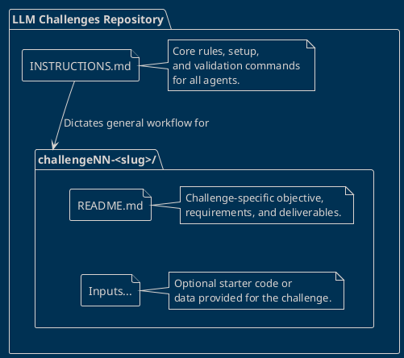

# Repository Overview

This repository is designed as an automated benchmark suite for testing Large Language Model (LLM) agents on various software engineering tasks. 

Below is an overview of the repository's structure:

## Structure Explanation

*   **`INSTRUCTIONS.md`**: The universal entry point and rulebook. This file dictates the strict workflow, directory naming conventions, and timing mechanisms that all agent harnesses must follow to produce valid benchmark results.
*   **`challengeNN-<slug>/`**: A generic representation of the challenge directories. The repository is modular, allowing new challenges to be added over time. Each directory isolates a specific problem to solve.
    *   **`README.md`**: Contains the precise specifications, evaluation criteria, and expected deliverables for the specific challenge. Agents rely on this to understand their goal.
    *   **Inputs**: Optional additional files specifically referenced by the challenge's `README.md` that provide starter code or necessary data.

*Note: In accordance with the challenge specification, solution result directories (`[harness]_[model]_[date]/`) and benchmark result summaries are deliberately omitted from this overview.*
