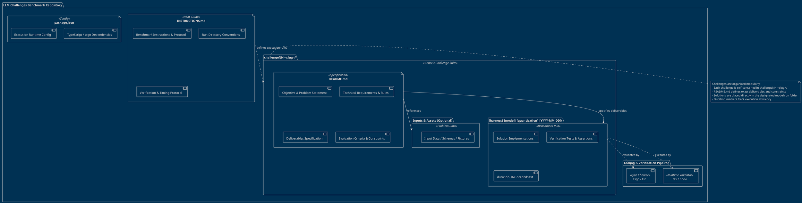

# Repository Architecture Overview

## Summary

The **LLM Challenges Suite** is an autonomous benchmarking harness designed to evaluate code generation, type system reasoning, creative coding, bug fixing, and software design across modern LLM agents.

The repository follows a clean, modular, challenge-driven architecture where each challenge is completely decoupled and self-contained.

---

## Architectural Diagram

The diagram below outlines the structural hierarchy, specification mechanisms, and verification workflows of the repository.

---

## Key Components

### 1. Root Level Protocol (`INSTRUCTIONS.md`, `package.json`)
- **`INSTRUCTIONS.md`**: Provides the standardized evaluation protocol for all agent runs. It defines naming conventions for evaluation folders (`[harness]_[model]_[quantisation]_[YYYY-MM-DD]`), compilation commands using `tsgo`, runtime test execution instructions, and precise timing marker rules.
- **`package.json`**: Configures the compilation and runtime toolchain (including TypeScript / `tsgo` and execution engines).

### 2. Challenge Suites (`challengeNN-<slug>/`)
Every challenge follows a uniform layout:
- **`README.md`**: The authoritative specification document containing the problem statement, technical requirements, edge case expectations, deliverables list, and grading criteria.
- **Problem Inputs (Optional)**: Fixtures, raw data, or initial code files required for the task.
- **Evaluation Run Folders**: Each benchmark run places deliverables directly into a dedicated folder tagged by harness, model, and date.
- **Duration Markers**: Tracks the benchmark execution time via `duration-<secs>-seconds.txt`.

### 3. Tooling and Verification Pipeline
- **`tsgo` / `tsc`**: Validates strict compilation, zero type errors, and recursive type constraints under modern ECMAScript targets (`--target ES2024 --module NodeNext`).
- **`tsx` / `node`**: Executes runtime test suites and assertion harnesses.
