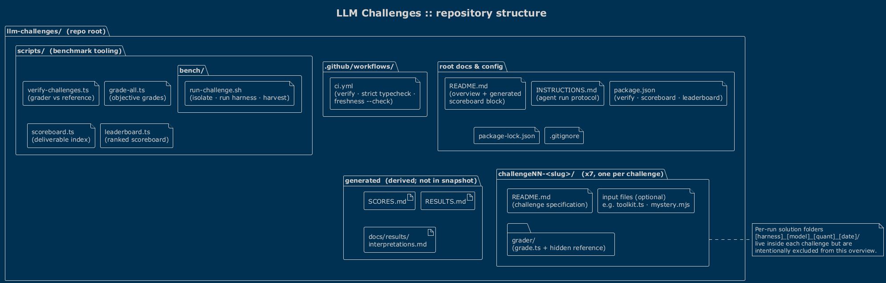
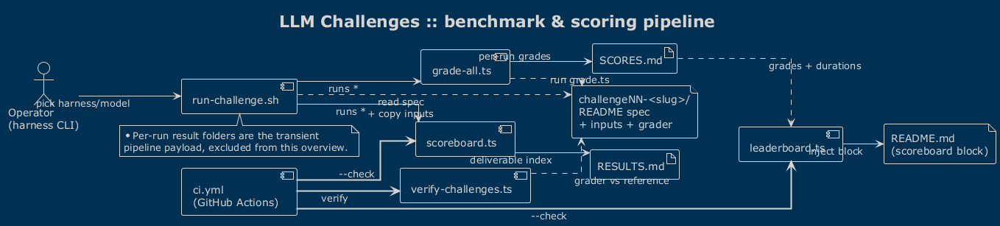
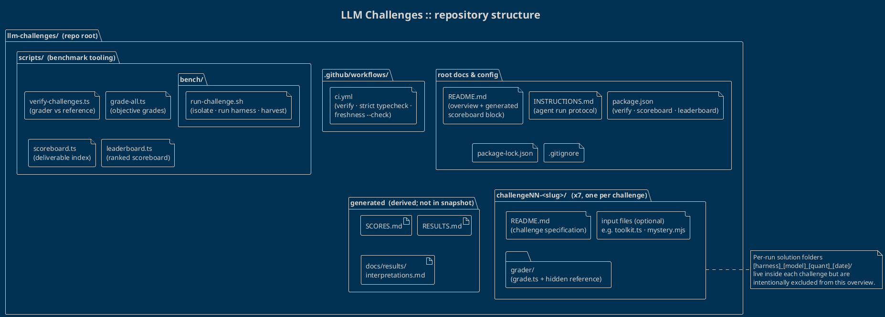

# LLM Challenges :: repository overview

`llm-challenges` is a lightweight benchmark harness for comparing **harness + model**
combinations (for example `claude · opus-4.8`, `gemini · gemini-3-pro`) on a fixed set
of self-contained TypeScript coding challenges. Each run produces deliverable files; an
objective grader scores them; and a set of scripts roll those scores up into a ranked
scoreboard that is injected back into the top-level `README.md`.

Two complementary PlantUML views describe the repository. Both use the `!theme blueprint`
theme; the source is in [`overview.puml`](overview.puml).

- **Structure** shows *where things live* (the directory layout).
- **Pipeline** shows *how things flow* (running and scoring a benchmark).

Challenges are drawn **generically** as `challengeNN-<slug>/` so the diagram stays valid as
new challenges are added, and per-run **solution result folders are deliberately excluded**.

---

## 1. Repository structure



The repository is organised by responsibility rather than by file type:

| Area | Contents | Role |
| --- | --- | --- |
| **root docs & config** | `README.md`, `INSTRUCTIONS.md`, `package.json`, `package-lock.json`, `.gitignore` | Entry point, the agent run protocol, and the npm scripts (`verify`, `scoreboard`, `leaderboard`). `README.md` carries a generated scoreboard block between `LEADERBOARD` markers. |
| **.github/workflows/** | `ci.yml` | CI gate: verifies graders, strict type-checks the reference solutions, and fails if the generated docs are stale. |
| **scripts/** | `bench/run-challenge.sh`, `verify-challenges.ts`, `grade-all.ts`, `scoreboard.ts`, `leaderboard.ts` | The benchmark tooling that runs, grades, and reports on every run. |
| **challengeNN-&lt;slug&gt;/** (×7) | `README.md` (the spec), optional input files (e.g. `toolkit.ts`, `mystery.mjs`), and a `grader/` (`grade.ts` plus a hidden reference) | One self-contained challenge per folder. The `README.md` is the full specification; the `grader/` is the objective ground truth. |
| **generated** (derived) | `SCORES.md`, `RESULTS.md`, `docs/results/interpretations.md` | Produced by the scripts; not present in this sanitised snapshot. |

> The seven concrete challenges range from recursive utility types and a p5.js solar system
> through bug-hunting and reverse-engineering to type-level arithmetic and a frontier
> type-level lambda-calculus normaliser. They are represented generically here so the
> overview does not need editing when challenge #8 lands.

---

## 2. Benchmark & scoring pipeline



The flow from a single benchmark run to the published scoreboard:

1. **Run**: `run-challenge.sh` prepares an isolated workspace, copies the challenge
   `README.md` (and any declared input files), runs the chosen harness/model, then harvests
   the newly created deliverables into a per-run result folder together with a duration marker.
2. **Grade**: `grade-all.ts` invokes each challenge's `grader/grade.ts` against every result
   folder and writes the objective per-run grades to **`SCORES.md`**.
3. **Index**: `scoreboard.ts` scans the result folders and writes **`RESULTS.md`**, a
   deterministic list of every run and its deliverables.
4. **Rank**: `leaderboard.ts` reads `SCORES.md` plus the duration markers, applies the
   weighted rubric, and injects the ranked scoreboard back into **`README.md`**.
5. **Verify**: `verify-challenges.ts` runs every grader against its reference solution to
   prove the challenge infrastructure itself is still valid (an integrity gate, not a run grader).
6. **CI**: `ci.yml` ties it together: it runs `verify`, strict-type-checks the reference
   solutions, and uses `scoreboard --check` / `leaderboard --check` to fail the build if the
   generated docs drift out of date.

| Script | Reads | Writes | Purpose |
| --- | --- | --- | --- |
| `bench/run-challenge.sh` | challenge spec + inputs | per-run result folder | Execute one harness/model in isolation and harvest deliverables. |
| `grade-all.ts` | graders + result folders | `SCORES.md` | Objective per-challenge grades for every run. |
| `scoreboard.ts` | result folders | `RESULTS.md` | Deterministic index of runs and their deliverables. |
| `leaderboard.ts` | `SCORES.md` + durations | `README.md` block | Weighted ranking injected between the README markers. |
| `verify-challenges.ts` | graders + references | (exit status) | Integrity check that graders and references still agree. |

---

## Legend & conventions

- **`challengeNN-<slug>/`** is a generic placeholder. The real repository contains seven such
  folders (`challenge01-deep-readonly` … `challenge07-type-lambda`); they are not listed
  individually so the diagram remains valid as challenges are added.
- **Per-run solution result folders** (`[harness]_[model]_[quant]_[date]/`) are the transient
  payload of the pipeline. Per the brief they are **excluded** from this overview; only the
  repository structure, the challenges, and their specifications are shown.
- **`generated`** artefacts (`SCORES.md`, `RESULTS.md`, `docs/`) are derived by the scripts and
  are absent from the sanitised snapshot this overview was built from.
- Solid arrows denote data/artefact flow; dotted arrows denote a "reads / invokes" dependency;
  bold arrows are CI invocations.

---

## Rendering the diagrams

The source of truth is [`overview.puml`](overview.puml) (two `@startuml` blocks). Regenerate the
images with any PlantUML distribution:

```bash
# PNG (used above) or SVG
java -jar plantuml.jar -tpng overview.puml      # -> overview-structure.png, overview-pipeline.png
java -jar plantuml.jar -tsvg overview.puml
```

<details>
<summary>Full PlantUML source (also in <code>overview.puml</code>)</summary>



</details>
