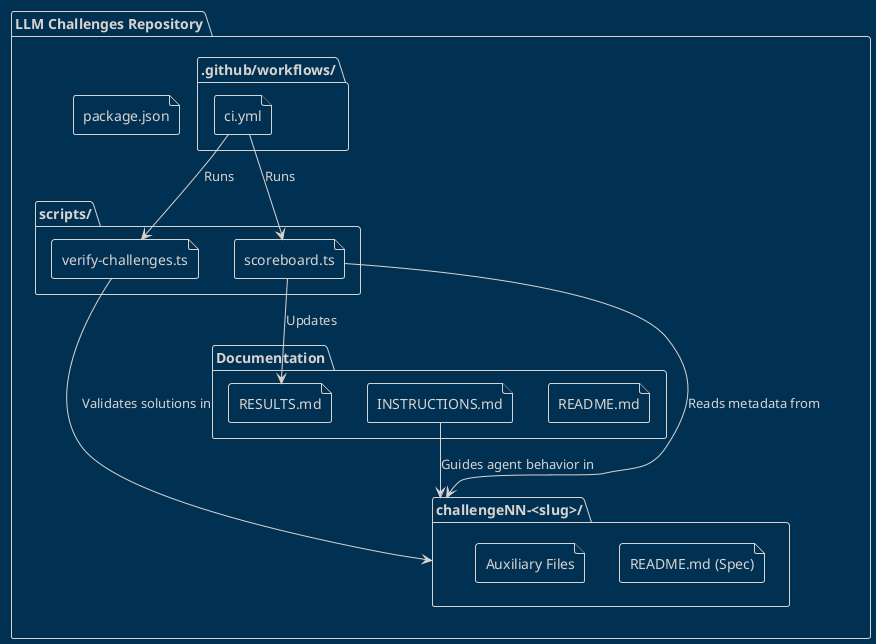

# Repository Architecture Overview

This repository is a framework for evaluating LLM agent performance on specific coding challenges. It contains guidelines for agents, scripts to evaluate their output, and modular challenge directories.

## Core Components

1. **Documentation**: Files like `README.md`, `INSTRUCTIONS.md`, and `RESULTS.md` coordinate the benchmarking process.
2. **Challenge Directories (`challengeNN-<slug>/`)**: Each challenge is self-contained with its own specification (`README.md`) and any necessary auxiliary files. The structure generically supports adding new challenges without altering the broader architecture. 
3. **Scripts (`scripts/`)**: TypeScript utilities (`verify-challenges.ts` and `scoreboard.ts`) that evaluate the agents' solutions and tabulate the results.
4. **CI/CD (`.github/workflows/`)**: Automates the execution of verification and scoring scripts.

## Diagram

The PlantUML diagram below outlines the primary structure and relationships between these components, intentionally omitting individual agent result folders for generalized clarity.

