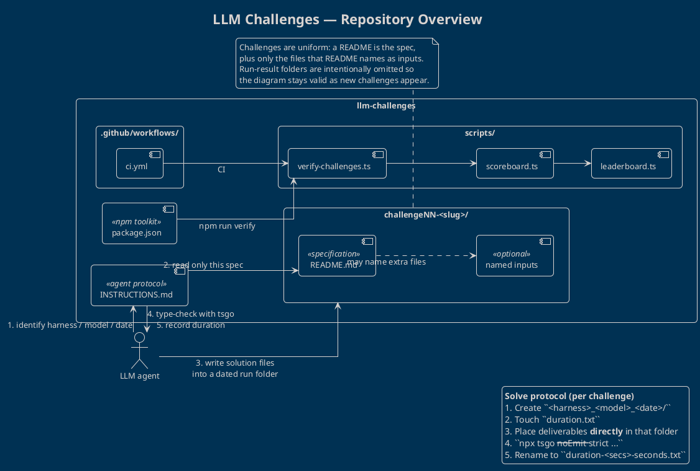

# LLM Challenges — Repository Overview

This repository is a **benchmark harness for LLM coding agents**. Each challenge is a self-contained specification; agents read a shared instruction file, produce TypeScript (or other) deliverables in a dated run folder, type-check them, and record how long they took.

The diagram below is the map of that system. Individual challenge titles, per-run result folders, and scoring internals are omitted on purpose: the layout is generic (`challengeNN-<slug>/`) so it remains accurate as challenges are added.

## Structure diagram

The PlantUML source lives in [`overview.puml`](./overview.puml) (`!theme blueprint`). Render it with any PlantUML processor, or use the inline copy below.

## How the pieces fit together

| Area | Role |
| --- | --- |
| `INSTRUCTIONS.md` | Shared agent protocol: identity, folder naming, verification command, timing files. Agents must not inspect other runs or private scoring trees. |
| `challengeNN-<slug>/` | One challenge. Always has a `README.md` specification; may include extra input files **only when that README names them**. |
| `scripts/` | Harness tooling: `verify-challenges.ts` checks submissions, then `scoreboard.ts` / `leaderboard.ts` aggregate results. |
| `.github/workflows/ci.yml` | Continuous integration entry point; drives the same verify path. |
| `package.json` | Declares `verify`, `scoreboard`, and `leaderboard` scripts, plus `tsx`, `typescript`, and the native `tsgo` preview compiler. |

## Agent workflow

1. **Identify** harness, model, and date, forming `<harness>_<model>_<date>/` inside the challenge directory.
2. **Read** only that challenge’s `README.md` (and any input file it explicitly names), plus `INSTRUCTIONS.md`.
3. **Write** deliverables *directly* in the run folder — no nested `solution/` directory.
4. **Verify** with `npx tsgo --noEmit --strict --target ES2024 --module NodeNext --moduleResolution NodeNext`.
5. **Time** the work via `duration.txt` → `duration-<secs>-seconds.txt`.

Challenges are independent. Adding `challenge08-<slug>/` with a `README.md` does not change this overview.
