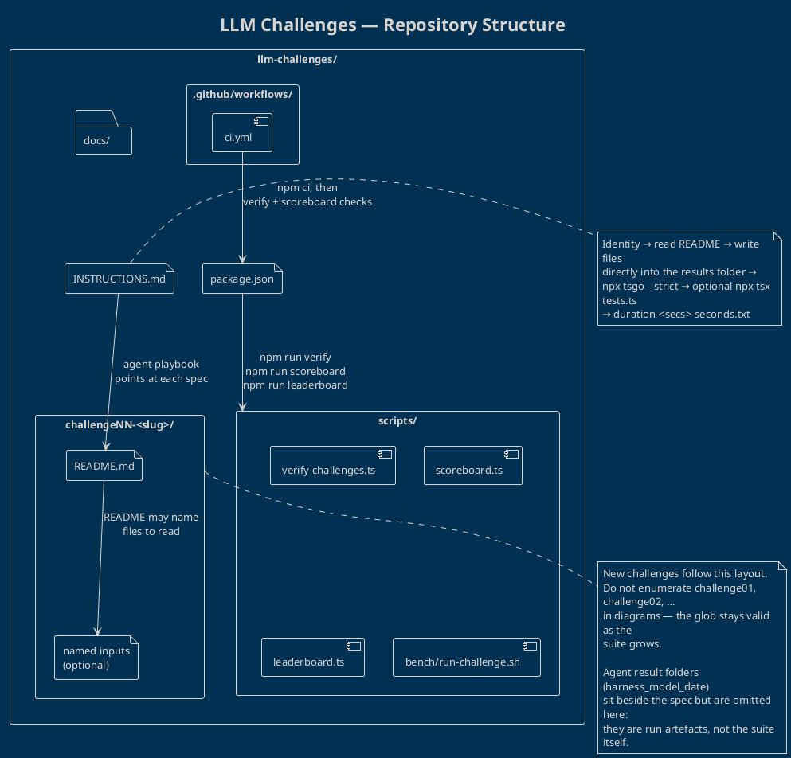
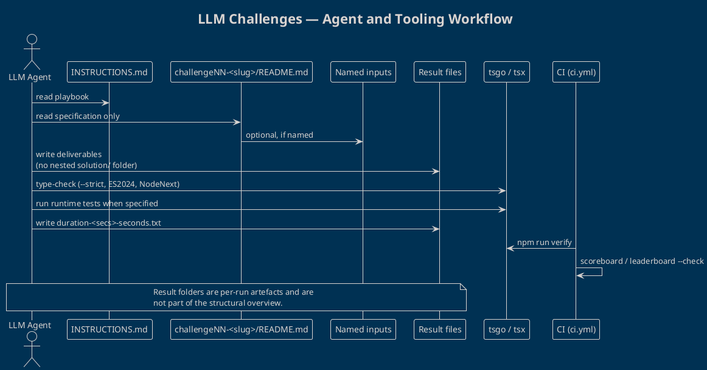

# LLM Challenges — Repository Overview

This repository is a **TypeScript benchmark suite for LLM coding agents**. Each challenge is a self-contained folder with a human-readable specification. Agents follow a shared playbook, write their deliverables next to that spec, and type-check against the same `tsgo` flags. Scoring and CI sit outside the challenge folders so new challenges can be added without changing the overall shape of the repo.

The canonical diagram source is [`overview.puml`](./overview.puml). Result folders such as `<harness>_<model>_<date>/` are **intentionally omitted**: they are per-run artefacts, not part of the suite’s structure.

## Structure

| Path | Role |
| --- | --- |
| `INSTRUCTIONS.md` | Agent playbook: folder naming, allowed inputs, `tsgo` flags, timing files |
| `package.json` | Tooling entry points (`verify`, `scoreboard`, `leaderboard`) plus `tsx` / `typescript` / `tsgo` |
| `challengeNN-<slug>/` | One challenge. **Always** has `README.md`. **Sometimes** ships extra files the README names as inputs |
| `challengeNN-<slug>/README.md` | Objective, requirements, deliverables, evaluation criteria |
| `scripts/` | Verification, scoreboard, leaderboard, and bench runner |
| `.github/workflows/ci.yml` | Installs deps, runs `npm run verify`, and checks generated scoreboard files |
| `docs/` | Supporting documentation (not part of a challenge spec) |

Challenges are shown as the glob `challengeNN-<slug>/` so this overview stays correct when challenges are added or renamed.

## Agent workflow

An agent solving a challenge does **not** browse the rest of the suite. It reads `INSTRUCTIONS.md`, the current challenge `README.md`, and only those extra files the README names.

1. **Identify** — form the results folder name from harness, model, optional quantisation, and date.
2. **Specify** — read `challengeNN-<slug>/README.md` (and named inputs only).
3. **Deliver** — write files *directly* into that results folder (never a nested `solution/`).
4. **Verify** — `npx tsgo --noEmit --strict --target ES2024 --module NodeNext --moduleResolution NodeNext`, then `npx tsx tests.ts` when the spec includes runtime tests.
5. **Time** — start with `duration.txt`, finish as `duration-<secs>-seconds.txt`.

CI reuses the same Node tooling: `npm ci`, `npm run verify`, a strict `tsgo` pass over reference sources, and `--check` on the scoreboard/leaderboard scripts. That pipeline grades the suite; it is not something an agent needs to open in order to solve a challenge.
