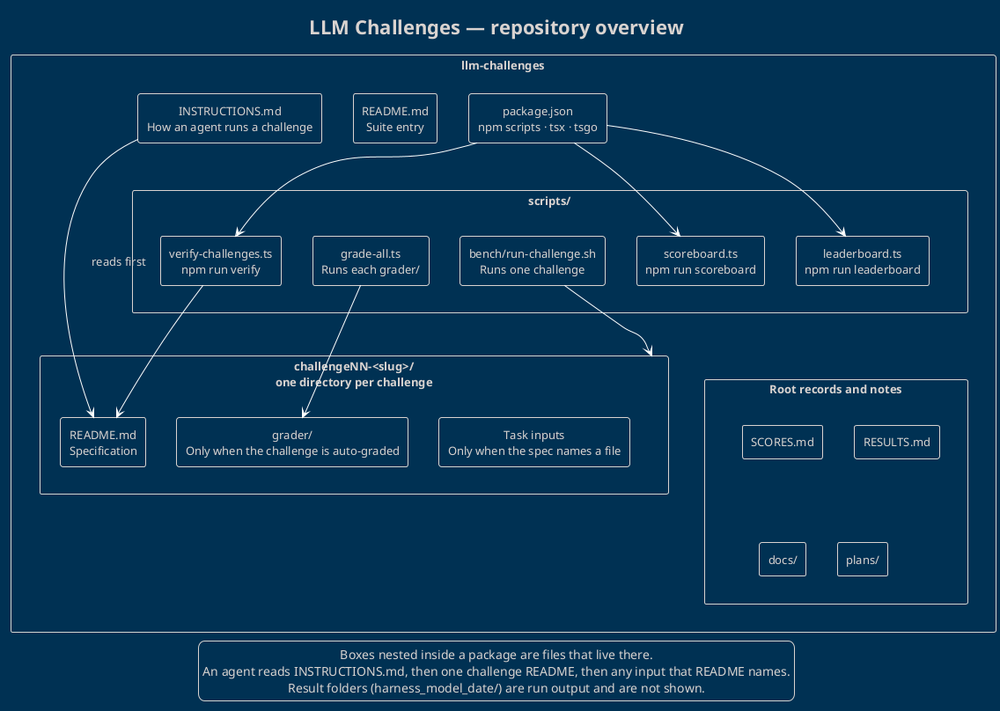

# LLM Challenges — repository overview

This repository is a benchmark suite for coding agents. A challenge is a directory. The agent reads that directory's specification, writes a solution, and the scripts under `scripts/` check and record the run.

The picture below is the structure of the suite, not a snapshot of who has solved it. Canonical source: [`overview.puml`](overview.puml).

## How a challenge is shaped

Every challenge is a directory named `challengeNN-<slug>/`. The number and the slug change; the shape does not, so the diagram stays valid when a challenge is added.

| Piece | Always there? | Role |
| --- | --- | --- |
| `README.md` | Yes | The specification: objective, deliverables, how it is judged |
| Task inputs | No | Extra files the README tells the agent to open |
| `grader/` | No | Automatic checks for challenges that have them |

`INSTRUCTIONS.md` is the run contract shared by every challenge: which folder name to use, which files may be read, the `tsgo` type-check, and how to record duration. The agent reads that, then the one challenge README, then any input that README names.

## How the suite is run

`package.json` is the toolchain (`tsx`, TypeScript, and the native `tsgo` preview) and the three npm entry points:

| Command | Script |
| --- | --- |
| `npm run verify` | `scripts/verify-challenges.ts` |
| `npm run scoreboard` | `scripts/scoreboard.ts` |
| `npm run leaderboard` | `scripts/leaderboard.ts` |

Two more scripts are not wired as npm aliases. `scripts/grade-all.ts` runs each challenge's `grader/`. `scripts/bench/run-challenge.sh` runs a single challenge.

`SCORES.md`, `RESULTS.md`, `docs/`, and `plans/` sit at the root beside that tooling. They are records and notes, not part of a challenge specification.

## Left off the diagram

A finished run lives in `challengeNN-<slug>/<harness>_<model>_<date>/`, with the solution files and a `duration-<secs>-seconds.txt` marker. Those folders are output. Drawing them would freeze the map to the current set of runs, so they are omitted. `node_modules/` and `package-lock.json` are the installed toolchain, not part of the benchmark's structure.
