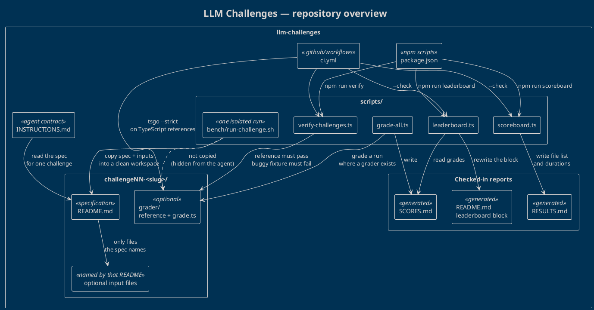

# LLM Challenges — repository overview

This repository is a benchmark suite for coding agents. Each challenge is a self-contained specification. Agents write a solution next to that spec; scripts grade the runs and publish two generated reports plus a leaderboard in the root README.

The map below is the whole contract. Challenges are drawn once, as `challengeNN-<slug>/`, so the picture stays valid when another challenge is added. Run folders (`[harness]_[model]_[date]/`) are artifacts of those runs and are intentionally not on the diagram.

## Diagram

Source: [`overview.puml`](overview.puml). Render with PlantUML (`plantuml overview.puml`).

## How to read it

**What an agent is allowed to see.** `INSTRUCTIONS.md` tells the agent to read one challenge `README.md`, write deliverables in its own result folder, type-check with `tsgo` when the solution is TypeScript, and leave a duration marker. If the spec names an input file, that file sits beside the README. Nothing else in the challenge directory is part of the prompt.

**What a challenge directory contains.** Every challenge is `challengeNN-<slug>/` plus a `README.md`. Some specs also name an input fixture. Later challenges add a `grader/` with a reference solution and a `grade.ts` that scores a run. The grader is repository infrastructure; `scripts/bench/run-challenge.sh` does not copy it into the agent's workspace.

**How a run becomes a published number.** The bench script is a one-shot harness: it builds a clean workspace from the spec and its declared inputs, runs one agent, and harvests the new files. Three TypeScript tools then publish the outcome:

- `scripts/grade-all.ts` scores every run and writes `SCORES.md`. Where `grader/grade.ts` exists it uses that; otherwise it checks compilation or that the expected files are present.
- `scripts/scoreboard.ts` only inventories runs (file list and `duration-<seconds>-seconds.txt`) and writes `RESULTS.md`.
- `scripts/leaderboard.ts` reads `SCORES.md` and those durations and rewrites the leaderboard block in `README.md`.

`package.json` exposes the three commands CI and humans regenerate or check: `npm run verify`, `npm run scoreboard`, and `npm run leaderboard`. `grade-all.ts` and `run-challenge.sh` are invoked directly.

**What CI guarantees.** `.github/workflows/ci.yml` installs dependencies, runs `npm run verify`, type-checks the TypeScript reference solutions with `tsgo --strict`, and fails if `RESULTS.md` or the README leaderboard is stale (`scoreboard.ts --check`, `leaderboard.ts --check`). `verify-challenges.ts` is the infrastructure test: each grader must accept its own reference, and a known-bad fixture must be rejected. CI does not re-score model runs; it checks that the checked-in reports still match the scripts.

`plans/` holds local notes. It is not part of the agent contract and CI does not read it.
