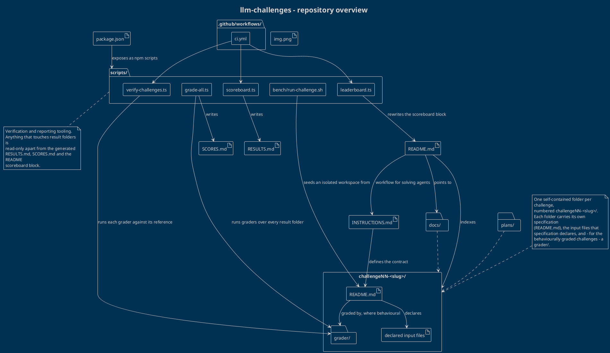

# Repository overview

`llm-challenges` is a benchmark suite for coding agents. Each challenge is a
self-contained specification plus, where the outcome can be judged
mechanically, a grader that scores submitted solutions. Agents read a single
challenge specification and write their deliverables into a per-run folder;
tooling in `scripts/` verifies the graders, grades the runs and derives the
summary documents.

The diagram below is the canonical source, kept in [`overview.puml`](./overview.puml).

## Structure at a glance

| Path | Role |
| --- | --- |
| `INSTRUCTIONS.md` | The contract every solving agent follows: how to name its result folder, what to write and how to verify it. |
| `README.md` | Entry point. Explains the benchmark and carries the generated model scoreboard block. |
| `package.json` | Declares the tooling scripts and the TypeScript/p5 toolchain used for verification. |
| `challengeNN-<slug>/` | One self-contained challenge: specification, declared inputs and, when applicable, a grader. |
| `challengeNN-<slug>/README.md` | The only file a solving agent is meant to read for that challenge; it lists the exact deliverables. |
| `challengeNN-<slug>/grader/` | Behavioural graders and their reference solutions, used by CI and by `grade-all.ts`. |
| `scripts/` | Verification, grading and reporting tooling. |
| `.github/workflows/ci.yml` | Runs the verification pass plus the staleness checks on every push to `main` and every pull request. |
| `docs/` | Supporting documentation that is not part of any single challenge. |
| `plans/` | Planning notes for benchmark runs and challenge evolution. |
| `RESULTS.md` | Generated table of every run and its duration; never hand-edited. |
| `SCORES.md` | Generated per-challenge scores for every run; never hand-edited. |

## How the pieces fit

- **A challenge is a folder contract.** Every challenge lives in its own
  `challengeNN-<slug>/` directory. The specification (`README.md`) names its
  deliverables and, when the challenge is mechanically judged, points at a
  `grader/` that knows how to score them.
- **Runs are isolated by construction.** `scripts/bench/run-challenge.sh` gives
  one agent one challenge in a scratch workspace that contains only the
  specification, its declared input files and a symlinked `node_modules`. The
  deliverables are then harvested into a per-run result folder whose name
  encodes harness, model, quantisation and date, together with a duration
  marker.
- **Grading is separated from submission.** `verify-challenges.ts` proves the
  graders themselves are sound by running each one against its reference
  solution, while `grade-all.ts` applies the same graders to the submitted
  result folders. The two never share state.
- **Reporting is derived, never authored.** `scoreboard.ts` writes `RESULTS.md`
  and `SCORES.md`; `leaderboard.ts` rewrites the scoreboard block inside
  `README.md`. Both are idempotent and expose a `--check` mode, so CI fails the
  build if the committed summaries drift from the runs on disk.
- **The challenge list is open-ended.** Because a challenge is just a
  `challengeNN-<slug>/` folder with a specification, the diagram and the tooling
  treat challenges generically: adding the next one requires no change to the
  structure shown above.
