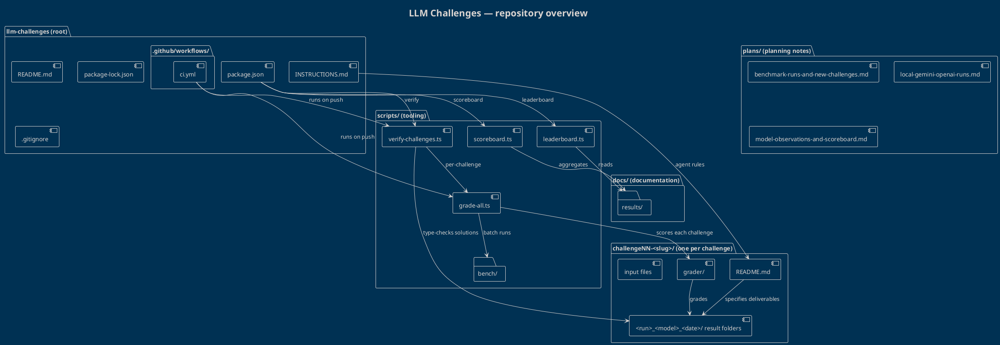

# Repository overview

This document gives a high-level picture of how the `llm-challenges`
repository is organised and how its parts relate. The accompanying PlantUML
diagram (`overview.puml`) renders the same structure visually.

## What this repository is

A benchmark suite of TypeScript coding challenges for LLM coding agents. Each
challenge is a self-contained folder with a `README.md` specification, optional
input files, an optional `grader/` (ground-truth checker), and one result
folder per agent/model/date run. A set of scripts grades and scores those runs.

## Structure at a glance

| Area | Purpose |
| --- | --- |
| `INSTRUCTIONS.md` | The rules every agent must follow (naming, verification, timing). |
| `README.md` | Top-level project documentation. |
| `package.json` | Scripts that drive verification, grading, scoreboard and leaderboard. |
| `challengeNN-<slug>/` | One folder per challenge: a `README.md` spec, optional inputs (`toolkit.ts`, `mystery.mjs`), an optional `grader/`, and result folders. |
| `scripts/` | The tooling: `verify-challenges.ts`, `grade-all.ts`, `scoreboard.ts`, `leaderboard.ts`, and a `bench/` helper. |
| `plans/` | Planning notes (benchmark runs, observations, scoreboard ideas). |
| `docs/results/` | Collected/aggregated results. |
| `.github/workflows/ci.yml` | CI that runs verification and grading on push. |

## The diagram

### Key relationships

- **`package.json` → `scripts/`** — the npm scripts (`verify`, `scoreboard`,
  `leaderboard`) are thin entry points into the corresponding TypeScript
  scripts.
- **`INSTRUCTIONS.md` → each `challengeNN-<slug>/README.md`** — the shared
  agent rules govern how a challenge is read and solved.
- **`challengeNN-<slug>/README.md` → result folders** — a challenge spec
  defines the deliverables that agents place in their result folders.
- **`grader/` → result folders** — graders check a run's solution against
  ground truth.
- **`scripts/` → `docs/results/`** — scoreboard and leaderboard aggregate the
  graded outcomes.
- **`.github/workflows/ci.yml` → `scripts/`** — CI verifies and grades on
  every push.

## Notes

- Challenges are shown **generically** as `challengeNN-<slug>/` so the diagram
  stays accurate as new challenges are added; no individual challenge names are
  hard-coded.
- Agent **result folders are intentionally omitted** from the structural
  overview; the diagram describes where they live without listing them.
- The diagram uses `!theme blueprint` for a consistent, print-friendly look.
