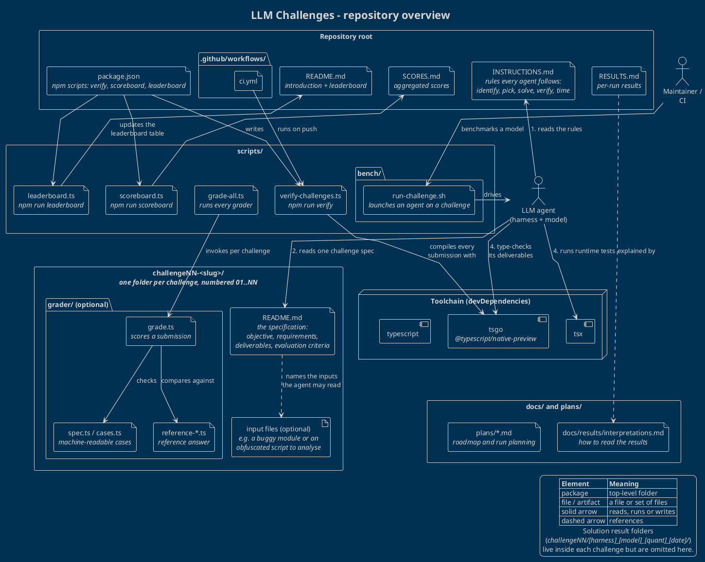

# LLM Challenges - repository overview

This repository is a benchmark suite for LLM coding agents. It holds a set of
self-contained TypeScript challenges, the rules an agent must follow to attempt
them, and the tooling that verifies, grades and ranks the submissions.

The diagram below is the source in [`overview.puml`](./overview.puml); render it with
`plantuml overview.puml` or any Markdown viewer that understands PlantUML fences.

## How the repository is organised

| Area | What lives there |
| --- | --- |
| Repository root | `INSTRUCTIONS.md` (the rules every agent follows), `README.md` (introduction and leaderboard), `RESULTS.md` and `SCORES.md` (recorded outcomes), `package.json` (npm scripts and the toolchain), `.github/workflows/ci.yml` |
| `challengeNN-<slug>/` | One folder per challenge, numbered from `01`. Its `README.md` is the specification: objective, requirements, deliverables and evaluation criteria. Some challenges ship input files the spec names explicitly (a module to debug, a script to reverse-engineer). Some carry a `grader/` with `grade.ts`, a reference answer and machine-readable cases. |
| `scripts/` | Repository automation: `verify-challenges.ts` type-checks submissions, `grade-all.ts` runs each challenge grader, `scoreboard.ts` and `leaderboard.ts` roll results up into `SCORES.md` and the root `README.md`, and `bench/run-challenge.sh` launches an agent on a challenge. |
| `docs/` and `plans/` | `docs/results/interpretations.md` explains how to read the results; `plans/*.md` hold roadmap and run planning notes. |
| Toolchain | Dev dependencies only: `tsgo` (`@typescript/native-preview`) for type-checking, `tsx` for running tests, and `typescript`. |

## How a challenge is attempted

1. The agent reads `INSTRUCTIONS.md` and derives its result folder name,
   `challengeNN/[harness]_[model]_[quantisation]_[YYYY-MM-DD]/`.
2. It reads exactly one `challengeNN-<slug>/README.md`, plus any input file that
   spec names. Graders, other result folders and the results documents are
   off limits so every run is solved from first principles.
3. It writes the deliverables directly into its result folder.
4. It verifies with `tsgo --noEmit --strict` and, where the spec has runtime tests,
   `tsx tests.ts`, and records how long the attempt took in a
   `duration-<seconds>-seconds.txt` marker.

## How results flow back

Maintainers (or CI on push) run `npm run verify` to make sure every submission
compiles, `grade-all.ts` to score the challenges that have a grader, and then
`npm run scoreboard` and `npm run leaderboard` to refresh `SCORES.md` and the
leaderboard table in `README.md`. `docs/results/interpretations.md` gives the
reading guide for those numbers.

## Deliberate omissions

- Individual challenges are not listed; `challengeNN-<slug>/` stands for all of
  them, so the diagram stays valid as challenges are added.
- Solution result folders inside each challenge are left out; the diagram shows
  the repository, the challenges and their specifications only.
