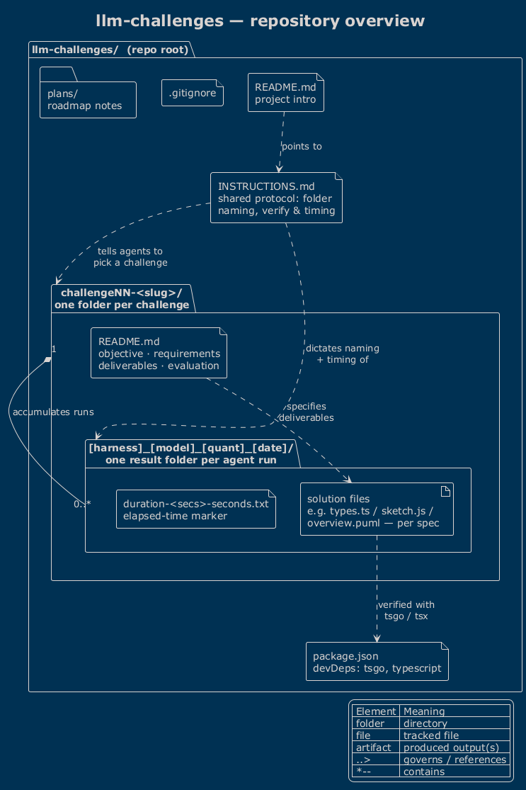
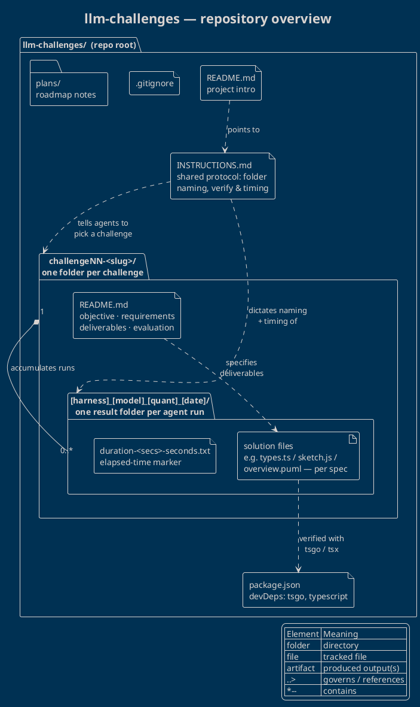

# Repository overview — `llm-challenges`

`llm-challenges` is a **benchmark harness for coding agents**. It is a deliberately
small repository whose value lies in its *convention* rather than its code: a set
of self-describing challenges that any LLM agent can pick up, solve in isolation,
and have its work captured in a consistently named, timed result folder.

## Diagram

The diagram below is generated from [`overview.puml`](overview.puml) using the
`!theme blueprint` PlantUML theme. A pre-rendered image is included as
[`repo-overview.png`](repo-overview.png).

PlantUML source (also in <code>overview.puml</code>)

## How it is structured

The repository has just two conceptual layers, which is why a single
package/component diagram captures it completely.

### Repo root

- **`INSTRUCTIONS.md`** — the heart of the harness. It defines the shared
  protocol every agent must follow: how to name a result folder
  (`[harness]_[model]_[quantisation]_[YYYY-MM-DD]`), how to verify a solution
  (`tsgo --noEmit --strict …`, `tsx tests.ts`), and how to record timing.
- **`README.md`** — short project introduction that points readers at the
  instructions.
- **`package.json` / `package-lock.json`** — dev dependencies only: the
  TypeScript native-preview compiler (`tsgo`) and `typescript`, used to
  type-check the TypeScript challenges.
- **`plans/`** — roadmap notes for future benchmark runs and challenges.
- **`.gitignore`** — keeps `node_modules/`, build output and logs out of
  version control.

### Challenge folders — `challengeNN-<slug>/`

Each challenge lives in its own numbered, slugged directory and is fully
specified by its own **`README.md`** (objective, requirements, deliverables and
evaluation criteria). Challenges are shown generically here so the diagram stays
accurate as new ones are added.

### Result folders — `[harness]_[model]_[quant]_[date]/`

Every agent run produces one result folder *inside* a challenge directory. It
contains:

- the **solution files** required by that challenge's spec (for example
  `types.ts` / `tests.ts` / `examples.ts` for the type-level challenge,
  `index.html` / `sketch.js` for the p5.js challenge, or
  `overview.puml` / `overview.md` for this one), and
- a **`duration-<secs>-seconds.txt`** marker recording how long the run took.

A single challenge therefore *accumulates many* result folders over time — one
per model/harness combination — which is exactly what makes the repository a
benchmark: the same specification, solved side by side by different agents.

## Key relationships

- `INSTRUCTIONS.md` **governs** the naming and timing of every result folder and
  tells agents which challenge to pick.
- Each challenge `README.md` **specifies** the deliverables that the result
  folder's solution files must satisfy.
- TypeScript solutions are **verified** against the toolchain declared in
  `package.json` (`tsgo`, `tsx`).
