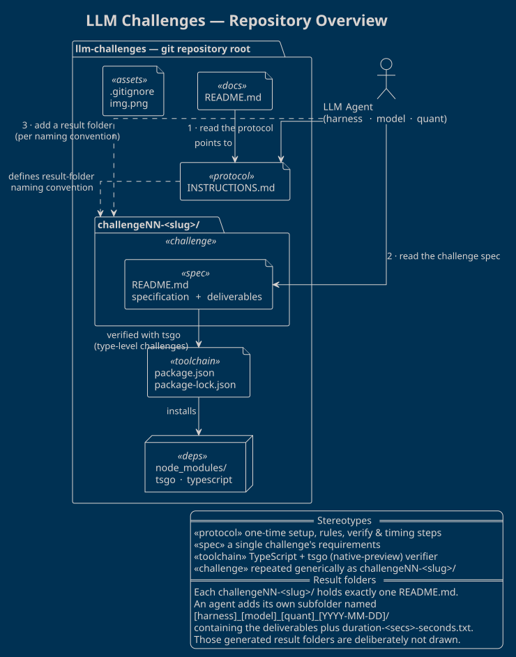
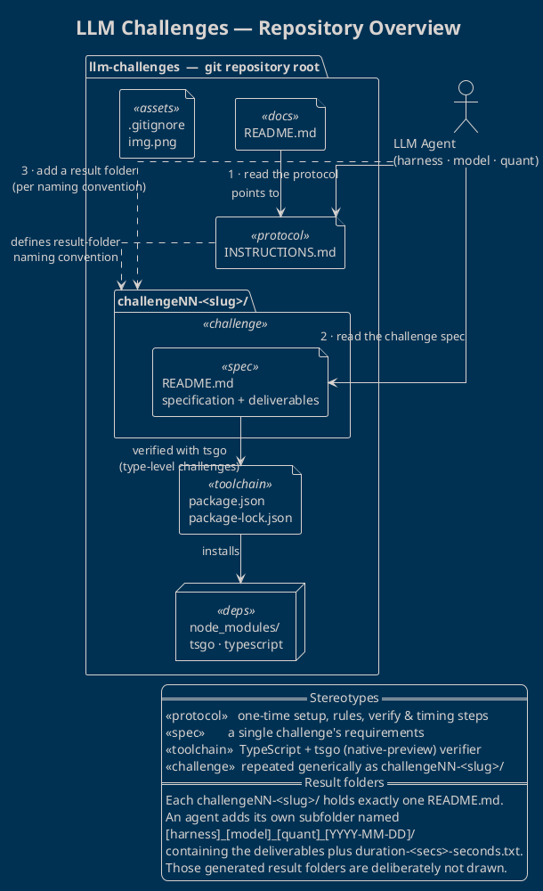

# LLM Challenges — Repository Overview

This repository is a lightweight benchmark for comparing coding agents
(harness + model + quantisation combinations). It is deliberately small: a
shared **protocol**, a set of self-contained **challenge specifications**, and a
minimal **TypeScript toolchain** used to verify the type-level challenges. Every
agent run produces its own result folder, so many solutions can live
side-by-side and be compared.

## Diagram

The overview below is a PlantUML **package / deployment** diagram (theme
`blueprint`). It captures the committed repository structure and the workflow an
agent follows, rather than any individual solution.

The source lives in [`overview.puml`](overview.puml); a rendered copy is shown
here:



<details>
<summary>PlantUML source (also in <code>overview.puml</code>)</summary>



</details>

## How to read it

- **`INSTRUCTIONS.md`** (`«protocol»`) is the entry point. It tells an agent how
  to identify itself, the exact result-folder naming convention, how to verify a
  solution, and how to record timing. `README.md` at the root simply points to
  it.
- **`challengeNN-<slug>/`** (`«challenge»`) is drawn once but stands for *every*
  challenge folder. Each one contains a single `README.md` (`«spec»`) holding
  that challenge's objective, requirements, deliverables and evaluation
  criteria. New challenges slot in by following the same pattern, so the diagram
  stays valid as the set grows.
- **`package.json` / `node_modules`** provide the verification toolchain —
  `typescript` and `tsgo` (the `@typescript/native-preview` compiler) — used to
  type-check the TypeScript challenges with the strict flags listed in
  `INSTRUCTIONS.md`.

## The agent workflow

1. **Read the protocol** — derive the result-folder name and the rules.
2. **Read the challenge spec** — the `README.md` inside a `challengeNN-<slug>/`.
3. **Write a result folder** — `[harness]_[model]_[quant]_[YYYY-MM-DD]/`
   containing the deliverables and a `duration-<secs>-seconds.txt` timing marker.

Generated result folders are intentionally **omitted** from the diagram: the
overview describes the repository's stable structure and its specifications, not
the per-run solutions that accumulate inside each challenge.

## Rendering the diagram

```bash
# SVG (scalable, used above)
java -jar plantuml.jar -tsvg overview.puml
# or PNG
java -jar plantuml.jar -tpng overview.puml
```

Both commands emit `repo-overview.*` (named after the `@startuml repo-overview`
id).
