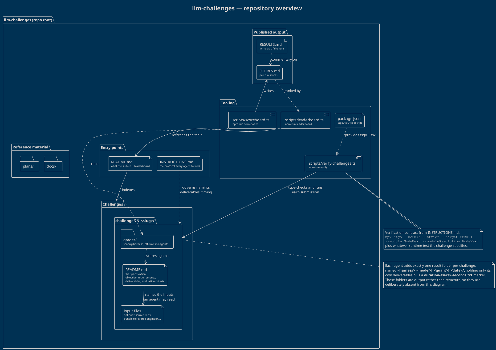

# llm-challenges — repository overview

This repository is a benchmark harness, not an application. It holds a set of self-contained
TypeScript challenges, the protocol that tells an agent how to attempt them, and the tooling that
verifies, scores and publishes the outcome. The diagram below shows those four concerns and how
they feed each other.

## The diagram

Source: [`overview.puml`](./overview.puml) — render with
`java -jar plantuml.jar -tpng overview.puml`, the PlantUML extension in your editor, or any
PlantUML server.

## How the repository is laid out

**Entry points.** `README.md` introduces the suite and carries the leaderboard; `INSTRUCTIONS.md`
is the contract an agent is handed before it starts. The contract covers four things: how to name
the result folder, where solution files live, which command proves the solution compiles, and how
to record elapsed time.

**Challenges.** Each challenge is one directory, `challengeNN-<slug>/`. The numbering is
chronological and the slug names the topic. Inside, the invariant is always the same:

| Item | Role |
| --- | --- |
| `README.md` | The specification: difficulty, topics, objective, requirements, deliverables, evaluation criteria. It is the single source of truth for what "done" means. |
| input files | Optional material the specification explicitly names, such as a module to debug or a bundle to reverse-engineer. |
| `grader/` | The scoring harness and reference material, deliberately out of bounds for a solving agent. |
| result folders | One per run, added by the agent (see below). |

Because every challenge follows that shape, the diagram models a single generic
`challengeNN-<slug>/` rather than listing today's challenges: adding an eighth challenge does not
invalidate it.

**Tooling.** `package.json` pins the toolchain — `tsgo` (the native TypeScript preview compiler),
`tsx` for running TypeScript directly, and `typescript` itself — and exposes three npm scripts.
`verify` walks the submissions and type-checks them, `scoreboard` turns grader verdicts into
`SCORES.md`, and `leaderboard` folds those scores back into the table in the root `README.md`.

**Published output.** `SCORES.md` holds the per-run numbers and `RESULTS.md` the accompanying
write-up. Both are derived artefacts: they are produced from graded runs, never edited by a
solving agent.

**Reference material.** `docs/` and `plans/` hold the suite's own documentation and forward
planning; they sit beside the challenges rather than inside them.

## The run workflow

1. An agent identifies itself and creates `challengeNN-<slug>/<harness>_<model>[_<quant>]_<date>/`.
2. It touches `duration.txt` in that folder to start the clock.
3. It reads only the challenge `README.md` and the inputs that README names, then writes the
   deliverables directly into its result folder — no nested `solution/` directory.
4. It verifies with
   `npx tsgo --noEmit --strict --target ES2024 --module NodeNext --moduleResolution NodeNext`,
   plus any runtime test the challenge asks for.
5. It writes the elapsed seconds into the marker and renames it to `duration-<secs>-seconds.txt`.

Grading then runs separately: the per-challenge `grader/` scores each submission against its
specification, `scoreboard` records the result, and `leaderboard` republishes the ranking. The
one-way flow — specification → submission → verdict → published ranking — is what keeps a run
reproducible and comparable across models.
