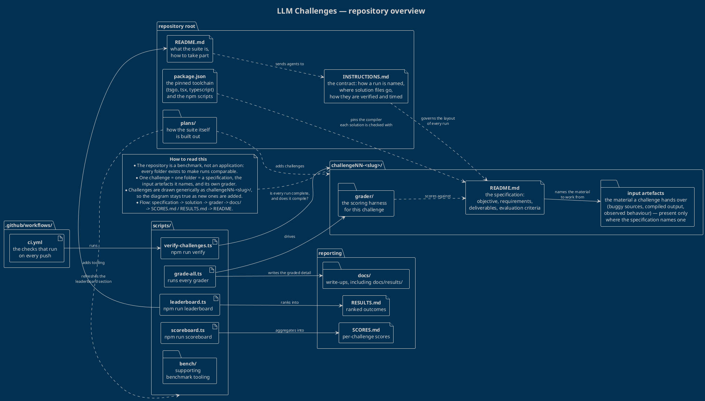

# LLM Challenges — repository overview

This repository is a **benchmark**, not an application. Nothing here ships to a user: every
folder exists so that a run by one agent can be compared, fairly and repeatably, with a run by
another. The diagram below is the map.

## The diagram

Source: [`overview.puml`](./overview.puml). Render it with any PlantUML renderer, for example:

```bash
java -jar plantuml.jar -tsvg overview.puml   # or -tpng
```



## How the repository is organised

### The contract, at the root

`INSTRUCTIONS.md` is the single source of truth, and everything else defers to it. It fixes four
things that would otherwise drift from run to run: how a run is **named**
(`challengeNN-<slug>/<harness>_<model>_<quantisation>_<date>/`), that solution files live
**directly** in that folder with no intermediate `solution/` directory, how a solution is
**verified** (`tsgo --noEmit --strict --target ES2024 --module NodeNext --moduleResolution NodeNext`,
plus `tsx` for any runtime tests), and how a run is **timed** (a `duration.txt` marker created
before the first solution file and renamed to `duration-<secs>-seconds.txt` at the end).

`README.md` is the front door and points agents at those instructions; `package.json` pins the
toolchain every solution is measured with and exposes the npm scripts that drive the suite;
`plans/` is where the suite's own build-out is sequenced.

### The unit of work: one folder per challenge

Each challenge is a self-contained package named `challengeNN-<slug>/` and always holds the same
three kinds of thing:

| Part | Role |
| --- | --- |
| `README.md` | The **specification**: objective, requirements, edge cases, deliverables and the evaluation criteria a run is judged against. It is the only prose an agent is meant to read. |
| Input artefacts | The **material to work from** — a buggy source file, a compiled bundle to reverse engineer, a set of type puzzles. Present only where the specification names one, which is why the diagram shows it as a single generic node. |
| `grader/` | The **scoring harness** for that challenge, kept next to the specification it scores against. |

The challenges themselves are deliberately drawn generically. They range from type-level work
(recursive utility types, a type-level evaluator) through creative coding and documentation to
debugging and reverse engineering, and new ones are added over time — so the diagram names the
*shape* of a challenge folder rather than any individual challenge, and stays accurate as the
suite grows.

Run folders (one per agent, per challenge) sit inside each challenge folder and are, by the
challenge brief, left off this diagram: they are output, not structure.

### Tooling, CI and reporting

`scripts/` turns folders full of solutions into numbers. `verify-challenges.ts` (`npm run verify`)
is the gate: it checks that runs are complete and that they compile. `grade-all.ts` drives every
challenge's grader and writes the graded detail under `docs/`. `scoreboard.ts`
(`npm run scoreboard`) aggregates per-challenge scores into `SCORES.md`, and `leaderboard.ts`
(`npm run leaderboard`) ranks runs into `RESULTS.md` and refreshes the leaderboard in the root
`README.md`. `scripts/bench/` holds the supporting benchmark tooling. The GitHub Actions workflow
in `.github/workflows/ci.yml` runs the checks on every push, so a broken or half-finished run is
caught in the repository rather than in a report.

The whole thing reads as one pipeline:

```
specification -> solution -> grader -> docs/ -> SCORES.md / RESULTS.md -> README
```

### Why it is shaped this way

- **Co-location.** Specification, inputs and grader live together, so a challenge can be added or
  changed without touching anything else.
- **Uniformity.** One naming convention and one verification command mean a result is a result, no
  matter which agent produced it.
- **Extensibility.** Because everything generic is generic — `challengeNN-<slug>/`,
  `<harness>_<model>_<quantisation>_<date>/` — the tooling and this diagram both keep working as
  challenges and contenders accumulate.
