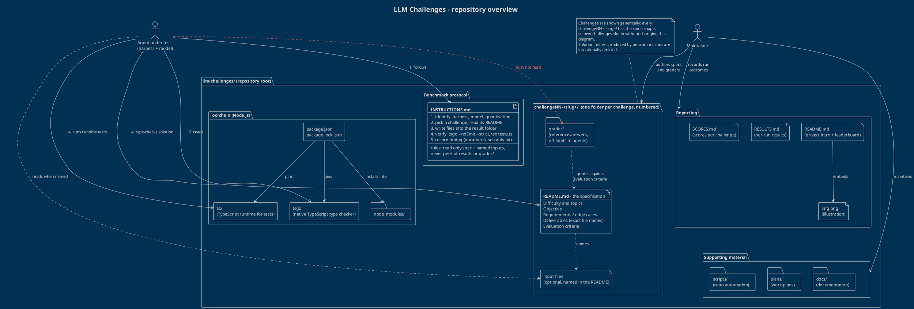

# LLM Challenges: repository overview

LLM Challenges is a benchmark suite of (mostly TypeScript) tasks for coding agents. Each challenge is a
self-contained specification; an agent (a harness plus a model) solves it following a shared protocol, and
the outcomes are collected into the repository's reporting pages.

![Repository overview diagram](https://www.plantuml.com/plantuml/svg/hLXjJniv4FwUNs7HBvGZuQrKQeIGU5MH8Aq8lVjGgfFPTH8tNdlFzfBaJhtVVi_OtcH3u5fQAgLQspEpCyyydfdbmFcP4eSjngmndls31yQEUJOUMbFf_CGeOzchxUszdVszS7Pkj4-xf-zEzqwtvxizNWZskx0vrpnilf-LmbvAFLwLnwvuVFTc9BEn5iwndR1tnUrGQhQFnJVySfDLXT2rfnallJGwhHvQY5Q_XVy724_O7n0S2Px_aA2NNecv727GbtyBjhlx7KtwQPFNgbTyAekg-4FcViJsjhUJHCcjbvai-JpM6Wcs4srzv7akzH0R4Po3hPJBbXjB3NrUi2DhpUJIA2LBKou3lX1wAjqBYLCnu9NoArbUaRWoshYIPoAVovwOoafX6xANSY0KmEbxoxqOpe26Cqhc3P6--AiIEXCaIZWU6ukaF1L0VyHpCo4i1bmvqJZvvCInyBnFm31lAx44JkRblVIpWE_Jd3_czY5L7tFdyQkn0jct9l3qEcwZ0wlQowBJ83LF-jBfYRIP4ld92Akifld_kbDdXR5hdilAiNVB1XK7Px-3oyk045vrvBsLTvKNt_VyIHjz12wCHz7vEIFdYmhnRDttYwBnV5qgaxWFuw3-D0KkCgC_8XjyA1wHV3fJApQilEV-Lsq0Ap0j_pKhrPsIsK-Rw9cVvSk7kw_mFlBx4HOtHPk8ln3Z-xw6_tcNQzb6JVQZ5xDqycAMpbxCqiMBMUhzeYMqaXFkH3Huyymgquh3mkNb5KEHLaheeN2ipQmeZPFUe0UOUs7lfPWqErHcYj9eZ3knWLcGbkkXQdQuCl8p2WoCofTQxSJoCaqMkysEIVE74oLxqzoqN8zfSt-xrK8RGKnhHqEQjO0MYfiNpj_gTVIOCD3ynWeOKQ_N67UCarojTCMbzlW96ywA-RBLIjwoDQMATZP7OekjDv2WIJIQJJDf68UIuZ76Wb71xPYLg44cCof8reiqAz7mD80xJ6g7jf_HaEZOvpIPRMnSzFetrvzERYu-zFgT8j_OI2Tj_4kFEnqcSqGb1xCkIq5lnfWtsLyLvZBfEDbDyhiTLcBOOvpDuzf4ndZEf7Vi-kpezEeiYUvra1Y96Z2G2ZG0F8Rv4UNNOOQginXbttGOY16Sy6vesB_jjZPdXVJqXDXavZTnCWtfSHtlajv-X-W2JcDEBMXYMCyh6_njzzeE9pg7zDI_NetSLl2g6tqtMisOAqM6V6jm6j7eil9kCybg0UzOAGG2zoa0ny22eQMEk1N4leJvj9d5EKIzNll0gMfukCNOEgYUWeT5syHHLyKTxbqUQJ4_U9ZjuEWYon7qa5_SDKAO1EH0Pit4DI8_bGCS8eGPunh86MIq1ZJs37alqleQ8wgqWZv67DjY8eSx6Gf4BN-A6HVOy3jAyRgOad-Kxm2Zgs4_k-Ug2jwmZ2XX9Pz3ngByMa0ySWNtpuGl7WuIrla8aSLO8punHUcp9y2vbj81VIi6G1ApDK9q4s7TvgqsWq5RWIQ815GCbzb5Kr5l9N_NkAq0NG_ZDQrNAH_HxJdwU2ckP-YueBere98AyzATuJQbbCXMY2Nj_gVBctvI5xPjArtpgrO9YuPE_-G3rAAA0_S1_1AFebuyQU9R33kb7a99AbKv7wz9Wh90l2lXzwkoZhZW8Mcn2hcuNyEGiCStgoFaws_NXdawMf8j5R92mXD39OvMKJ8yBeaw4ARqBkQqHDegRug6xNI-uloDCGgGW3VhFLIppjVq1Z_VJz_MTVE1Lr4NeaRVwhHgAvEDmrPqS3nyg4O52zvfJjU6KS_i1vzO6DApaSZ6mgQNGtHLVGhjXXeeW696DI9sezfnDrq2XfhRdoZKLCQsWeGk0Wh08N0RL_vmkJDqgTn3Nvc9QyY4UjAbqaxyh4ywdSDqnLYiaevDHaB7-zZG3lMwInMSucs7U94MewfGVPg2qoY70DqyoX1X_ShFhyxFtnw_FVw2TySx2Os3Z2QFRZewBC1TT7OVV3hO2eVqrm0AOiddK85QoGoTf3Z33ZLpJk3SehQl5gSMyjoCheHeOs_wS4iNs25pk8EnrRLQYuaWY2pAUPT8F3BM1OzGxQWAHp_TGwr5qUccJXUWGp6hF4WaLXJgozcTJoIk5SjEv0FTT1mAT1gakXNNxSyZcMCC-9ARYMx7-zhIzE61vi3COE4yVSGiHZjkqMn6q6787u3BS88MJjronXxhVYCYCdKe6XpTY9U2MgmpwB2JXGA0KORAA9j808MsW2Cz91JyIAAUI0wuYWvK-ubdwLg44IclCdICkncxcqzHWNBaBI2XQOTQ2rg-GJF0vrsd9P01YhVr7m00)

The diagram source is [`overview.puml`](overview.puml) (rendered above via the public PlantUML server; it
uses `!theme blueprint`). It is a component-style view: packages are folders or concerns in the
repository, actors are the people and agents interacting with it.

## How the repository is organised

| Area | What lives there | Role |
| --- | --- | --- |
| `INSTRUCTIONS.md` | The benchmark protocol | How an agent names its result folder (`<harness>_<model>_<quantisation>_<date>`), where to write files, how to verify (`tsgo --noEmit --strict`, `tsx tests.ts`), how to record timing, and what it must never read. |
| `challengeNN-<slug>/` | One folder per challenge, numbered | `README.md` is the specification: difficulty, topics, objective, requirements, exact deliverables and evaluation criteria. Some challenges ship input files that the README names explicitly. |
| `challengeNN-<slug>/grader/` | Reference material for grading | Used to assess submissions against the evaluation criteria; off-limits to agents under test. |
| `README.md`, `RESULTS.md`, `SCORES.md`, `img.png` | Reporting | Project introduction and leaderboard, per-run results and per-challenge scores. |
| `docs/`, `plans/`, `scripts/` | Supporting material | Documentation, work plans and repository automation for maintainers. |
| `package.json`, `package-lock.json`, `node_modules/` | Toolchain | Pins the tools used for verification: `tsgo` (native TypeScript type checker) and `tsx` (runs TypeScript tests directly). |

## The flow of a benchmark run

1. The agent reads `INSTRUCTIONS.md` and derives its result folder name.
2. It reads a challenge's `README.md` (plus any input files the README names) and nothing else.
3. It writes its deliverables into its own folder inside that challenge (not shown in the diagram).
4. It verifies them with `tsgo` and, where the challenge requires runtime tests, `tsx`.
5. It records how long it took; the maintainer then grades the run and records the outcome in the reporting pages.

## Design choices in the diagram

- **Generic challenges:** challenges are drawn once as `challengeNN-<slug>/` because every challenge has the
  same shape, so the diagram stays valid as new challenges are added.
- **No solutions:** result folders produced by runs are deliberately left out; only the structure, the
  challenge specifications and the protocol around them are shown.
- **Two actors:** the agent under test (reads the protocol and specs, uses the toolchain, must not read
  `grader/`) and the maintainer (authors challenges, records outcomes, maintains supporting material).

## Diagram source

