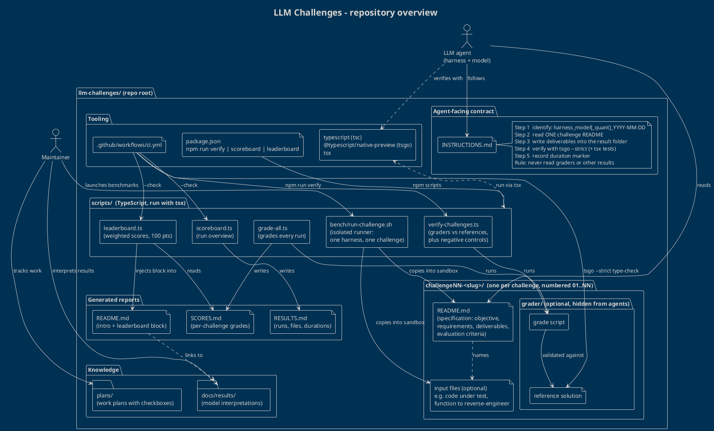

# LLM Challenges - repository overview

This repository is a benchmark suite for LLM coding agents. Each challenge is a self-contained
specification; agents solve it in a dated result folder, and a small set of TypeScript scripts
grades the runs and publishes scoreboards.

> Diagram source: [`overview.puml`](overview.puml) (`!theme blueprint`). It is inlined below so
> Markdown viewers with PlantUML support render it directly; otherwise render it with
> `plantuml overview.puml`.

## How the pieces fit together

| Area | What lives there | Role |
| --- | --- | --- |
| `INSTRUCTIONS.md` | The agent-facing contract | How an agent names its result folder, where to put files, how to verify (`tsgo --strict`) and how to record the duration marker. It also forbids peeking at graders or other runs. |
| `challengeNN-<slug>/` | `README.md` + optional inputs + optional `grader/` | One folder per challenge. The README is the **specification** (objective, requirements, deliverables, evaluation criteria). Some challenges ship input files (code under test, a function to reverse-engineer). Behaviourally graded challenges carry a hidden `grader/` with a grade script and a reference solution. |
| `scripts/` | TypeScript tooling run with `tsx` | `verify-challenges.ts` proves every grader accepts its reference solution (and rejects negative controls); `grade-all.ts` grades runs into `SCORES.md`; `scoreboard.ts` writes `RESULTS.md`; `leaderboard.ts` turns scores into a weighted 100-point leaderboard injected into `README.md`; `bench/run-challenge.sh` runs one agent on one challenge in an isolated sandbox. |
| Generated reports | `SCORES.md`, `RESULTS.md`, `README.md` leaderboard block | Derived data only; never edited by hand. |
| Knowledge | `docs/results/`, `plans/` | Human-written interpretation of model behaviour and checklists for benchmark campaigns. |
| Tooling | `package.json`, `.github/workflows/ci.yml` | `npm run verify / scoreboard / leaderboard`; CI verifies graders, strict-type-checks the reference solutions and fails when the generated reports are stale. |

## Reading the diagram

- **Top:** the two actors. The *LLM agent* only touches the contract, a challenge specification (and the
  inputs it names) and the TypeScript toolchain. The *maintainer* launches benchmarks and curates knowledge.
- **Middle:** `scripts/` is the engine: it feeds sandboxes from challenge folders, runs graders and writes reports.
- **Bottom:** challenge folders on one side (spec, inputs, hidden grader) and generated reports and knowledge
  on the other, so the flow reads *specification -> grading -> reporting*.
- The challenge folder is drawn generically as `challengeNN-<slug>/`: adding a new challenge only adds another
  instance of the same shape, so the diagram stays valid. Result folders are intentionally left out.
