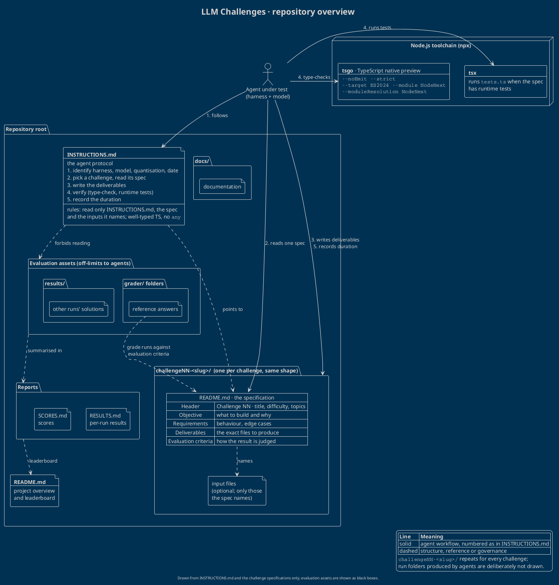

# LLM Challenges: repository overview

![Repository overview: the agent, INSTRUCTIONS.md, the generic challenge folder with its specification, the Node.js toolchain and the off-limits evaluation assets](https://www.plantuml.com/plantuml/svg/XLRDRXiv3BxhARXpgPFrk6tQNfnjq28Di0KI5x1Jx67JWpoYPrHhfAcayTXeqjVQ-pxPWjBysIsm9uyfaY8_aX_rpdbkVLqgC3kqEuaD-yqNM2AiLOsLbTephfHfIhcNEcTkAtN5BIyXCsLbD6g_yWU5O37pNESAHogDvTLVKlW2Nhr-CP9h8z1X1KT2o_MMX6_UZ8JSMjFS5pBRQdGENiuk6FFIAuJRspkuBhXIg7DqyEy_OB4oJdfZ3qCkZ6VUM4ZUvwWzr5gW1O_EF-X9mMtm-JkKHg0wIu0xuAJ7MCMpBSyHakNWqnhZWmvzm7V603Oo9Cv5YV0t0m0uFr_UlFzmTpChnVbvaAHfceQFofglcFaXDX9oBK0X5sZNXbl10BxqZgLstjQPbqQxtlt7nUf--Vdw_kEdnUeNb_W2OmvqdJUPKK7ySWPIeFPoSu0sxsbCUmhVQgwzT9pkcOBW7eF9nGmgcMs1GzQXF0svWlGEN8LPK7irWyPAZ-5cWKhkqFArGXTENyzWXvPkdVX3XMbMOBQTWgsrboM6IhYpeFbcHXrah8YEQXlYEKxErWhTF0PXj3h02HZJODk7HjYIGEggzWwa1yrBT9VGe58fnIFWVZK5RI19k3uaIG-_KTGeYJ2PUnvgJb_mFRWDjQ6ZkaJjGvYzohNHdXe8u6difqTmiKZ_SAhEhvu3J8n6gD2EyNMyH705hp2sOtyK-msWv1KaVOjHrtSfoutCXc18qiOBy6TeC7XxDGmCB1R1c4Pf2a9kDZAhbJzCmPjAPgwr_BIcbfKx9EEcu1wyWNKjbGZeDiMXLLpYjrfQ94GSwQwnu3jfQZi553b2nXrsJZ-CkeHqAGFSyym7Q1rTKLaZwWnRWviTLtN83JBgDIivsHMc2ROMNQqyI0TVQv6Z25PFR5Iiq07H-uEUc8fSSNKPcyWNnk63xd2CJHBXZvtJLRCdXL4yt3dq3YPciqcLB6aql8aJsFh0GRdjdxOfSajLUTx-Tq4volh2nUWjRj2YpX2uTasdsajTc-_OTuIaxTtspubNumkqD8dk6JYZwa0pGJ-SB6izE3vEdpZH-YwAy7qq6ikRrUVRUnh81rsXJMsjknZ6yTo9aStg-jFo9fgup5YCcl4pA3wn9yPeRq2oC09dNmbeexA2ImqJNUqZseEC8kfN57YNcvv3wS_vEVN__Q72LMPbHTmG-hoos9DpJpn9yYDDjRaffOSVQUgybPaFTD6UUMvpz72pkdXnyPfKIYDgXK2XBd1_f1kFbjY1VgpqvIJi_IZg_IdRK_KWIGADphnB4cWArCSiM13YOxuDbpmnzWpYKcoCtMwKQM3YZ99Y2hekrsXHn0au9Tap5lTBAaoZqwlZBJMdJRCnz5vm9tfXjkQqLeY_7H3xXI2FrGR6c_UxnHqjbWVTxmetB8hMYvLvuTEhMEyvxPzXxxYVbVPH9-0OmM7FO1NogIq6ZijfNsjEupSHt1KepbZ8PJQxwbRBF986EyA2pjkaAoDrO8QVDKRqC8UDiMifN4287bl3Z8-z1PA8CVESayS7ZJzJ91l9oBeRrJcukYovbGu5ICqwUTG9RvdvqPk4ROpnQE63vOs6ZJNbQK_qgtQetj5ASe5fByV9jiJ9BUqxqv00refdMrYRFRePOmfpr092iHZ0urkubHhfzmwvbZg7Hn93w5fuR9yzNJV_Nnktnh6YvAKh-dHWLZ1sN7woI7wrovE4m4Nk7LKGS8VsC41noSAWTZpVxJO1wqExA08ArE9hjDoZEe0s7WJ1FMEeHKI2iNUeHLqgzXy0)

The diagram source is [`overview.puml`](overview.puml) (`!theme blueprint`). The image above is rendered from it by the public PlantUML server, and the same source is embedded at the end of this page for viewers that render PlantUML natively.

## What this repository is

A benchmark suite for LLM coding agents. Each challenge is a self-contained TypeScript-centred task (type-level programming, runtime code, creative coding, documentation) described by a single specification. Agents solve challenges by following one shared protocol, so runs by different harnesses and models can be compared like for like.

## How it is laid out

| Path | Role |
| --- | --- |
| `INSTRUCTIONS.md` | The agent protocol: how to name a run, where to put files, how to verify them and how to record timing, plus the rules of engagement. |
| `challengeNN-<slug>/` | One folder per challenge, numbered and named by topic. All of them share the same shape. |
| `challengeNN-<slug>/README.md` | The specification: header (number, title, difficulty, topics), objective, requirements, deliverables and evaluation criteria. |
| input files (optional) | Material some specifications hand to the agent. An agent may read only the inputs its specification names. |
| `grader/` folders, `results/` | Evaluation assets: reference answers and other runs' solutions. They are off-limits to agents. |
| `RESULTS.md`, `SCORES.md` | Reports of runs and their scores. |
| `README.md` | Project overview and leaderboard. |
| `docs/` | Supporting documentation. |
| Node.js toolchain | `tsgo` (the TypeScript native preview) for strict type-checking and `tsx` for runtime tests, both run through `npx`. |

## The agent workflow

The numbered solid arrows in the diagram follow `INSTRUCTIONS.md`:

1. **Identify** the harness, model, quantisation and date. Together they name the run.
2. **Pick** a challenge and read its specification, plus any inputs it names. Nothing else.
3. **Write** exactly the deliverables the specification lists, directly into the run's own folder inside the challenge folder.
4. **Verify** with `npx tsgo --noEmit --strict --target ES2024 --module NodeNext --moduleResolution NodeNext`, and with `npx tsx tests.ts` when the challenge has runtime tests.
5. **Record the duration**: a `duration.txt` marker is created before any solution file and ends up renamed to `duration-<secs>-seconds.txt`.

## Evaluation and boundaries

The dashed arrows show structure and governance. `INSTRUCTIONS.md` points agents at a specification and forbids them from opening the evaluation assets, because those contain reference answers and competing solutions. Grading uses the reference answers together with each specification's evaluation criteria, and the outcomes flow into the reports and the leaderboard.

## Reading the diagram

- **Generic by design.** `challengeNN-<slug>/` stands for every challenge, so the diagram stays valid as challenges are added. No individual challenge is drawn.
- **Run folders are omitted.** Solution folders produced by agents are deliberately left out. Only the repository's own structure, the challenges and their specifications are drawn.
- **Black boxes.** This overview was drawn under the same rules it depicts, using only `INSTRUCTIONS.md` and the challenge specifications. So the evaluation assets, reports and `docs/` appear by role, with nothing claimed about their contents.

PlantUML source (identical to <code>overview.puml</code>)

